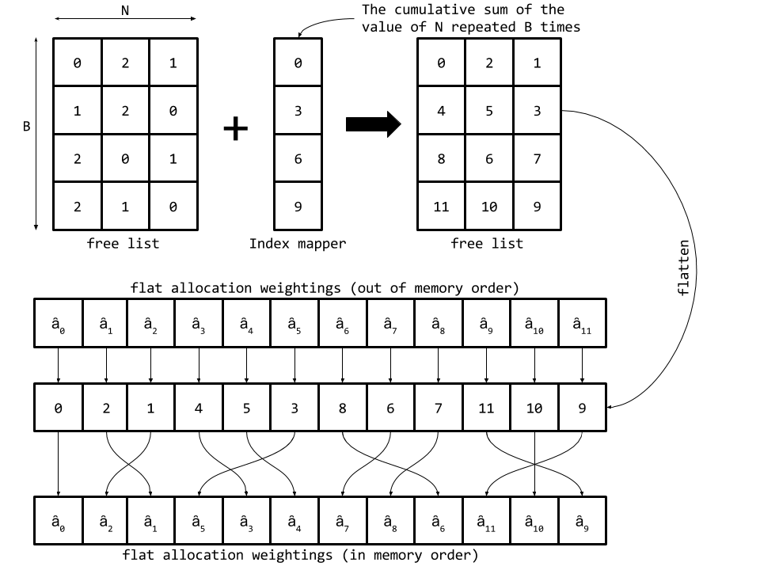

# Implementation Notes

## Mathematics

Two considerations were taken into account when the mathematical operations were implemented:

- At the time of the implementation, the version of TensorFlow used (r0.11) lacks a lot regarding slicing and assigning values to slices.
- A vectorized implementation is generally better than an Implementation with a python for loop (usually for the possible parallelism and the fact that python for loops create a copy of the same subgraph, one for each iteration).

Most of the operations described in the paper lend can be straightforwardly implemented in TensorFlow, except possibly for two operations: the allocation weighting calculations, and the link matrix updates; as they both are described in a slicing and looping manner, which can make their current implementation look a little convoluted. The following attempts to clarify how these operations were implemented.

### Allocation Weighting

In the paper, the allocation weightings are calculated using the formula:


This operation can be vectorized by instead computing the following formula:


Where  is the sorted usage vector and  is the cumulative product vector of the sorted usage, computed with `tf.cumprod`. With this equation, we get the allocation weighting  out of the original order of the memory locations. We can reorder it into the original order of the memory locations using `TensorArray`'s scatter operation using the free-list as the scatter indices.

```python
shifted_cumprod = tf.cumprod(sorted_usage, axis = 1, exclusive=True)
unordered_allocation_weighting = (1 - sorted_usage) * shifted_cumprod

mapped_free_list = free_list + self.index_mapper
flat_unordered_allocation_weighting = tf.reshape(unordered_allocation_weighting, (-1,))
flat_mapped_free_list = tf.reshape(mapped_free_list, (-1,))
flat_container = tf.TensorArray(tf.float32, self.batch_size * self.words_num)

flat_ordered_weightings = flat_container.scatter(
    flat_mapped_free_list,
    flat_unordered_allocation_weighting
)

packed_wightings = flat_ordered_weightings.pack()
return tf.reshape(packed_wightings, (self.batch_size, self.words_num))
```

Because `TensorArray` operations work only on one dimension and our allocation weightings are of shape *batch_size × N*, we map the free-list indices to their values as if they point to consecutive locations in a flat container. Then we flat all the operands and reshape them back to their original 2D shapes at the end. This process is depicted in the following figure.



### Link Matrix

 The paper's original formulation of the link matrix update is and index-by-index operation:

 

A vectorized implementation of this operation can be written as:


Where  is elementwise multiplication, and  is a *pairwise addition* operator defined as:


Where . This allows TensorFlow to parallelize the operation, but of course with a cost incurred on the space complexity.

*The elementwise multiplication by  is to ensure that all diagonal elements are zero, thus ensuring the elimination of self-links.*


## Weight Initializations

* **Memory's usage and precedence vectors and link matrix** are initialized to zero as specified by the paper.

* **Memory's matrix, read and write weightings, and read vectors** are initialized to a very small value (10⁻⁶). Attempting to initialize them to 0 resulted in **NaN** after the first few iterations.

*These initialization schemes were chosen after many experiments on the copy-task, as they've shown the highest degree of stability in training (The highest ratio of convergence, and the smallest ratio of NaN-outs). However, they might re-consideration with other tasks.*
