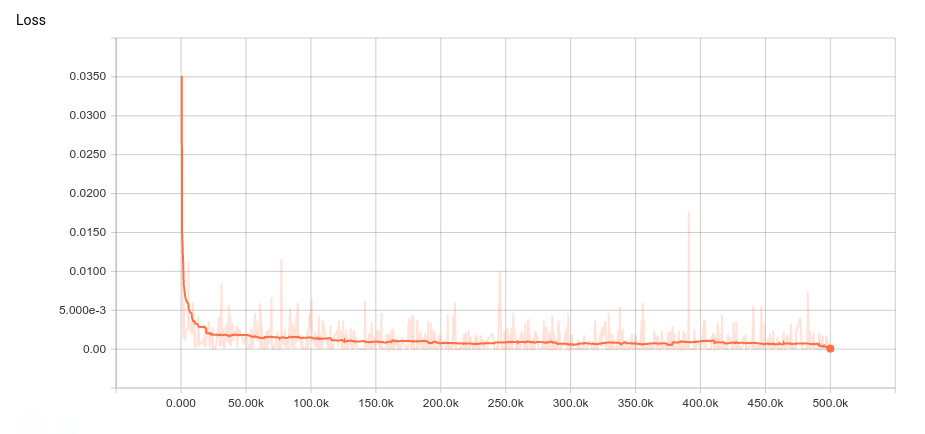

### Settings

- RMSProp optimizer with learning rate 10⁻⁴, and momentum of 0.9.
- Memory with 256 locations each with size 32, and 4 read heads.
- A recurrent neural network consisting of a single LSTM layer with hidden size 256. The RNN state is rest back to zero on the start of each new input sequence.
- The controller weights are initialized from a zero mean normal distribution with a standard deviation of 0.1.
- A batch size of 1.

The loss function is the cross-entropy between the softmax of the output sequence and the target sequence. All outputs that do not correspond to an answer step are ignored using a weights vector that has 1s at the steps with answers at them and 0s elsewhere.


Where **|D|** is the number of unique lexicons in the data.

All gradients are clipped between -10 and 10.

### Preprocessing

1. All words are brought to lower case, all the numbers are omitted, and all punctuation marks except for {?, ., -} are omitted. A dictionary is then built of the remaining unique lexicons.
2. All the data are encoded as numeric input and output vectors. The input vectors contains each word of the story as its numeric code in the dictionary, with all the words representing answers are replaced with the code for '-'. The output vector contains the codes for these replaced answer words.
3. All training data are joined together in one file and the testing data are kept separate.

This whole process is implemented in the `preprocess.py` file with the option to filter stories by sequence length as well as the option to save the training data separately. The script can also work for any version of the data, not just the **en-10k**, just by specifying the path to the desired data.

```
$python preprocess.py --data_dir [--single_train] [--length_limit]
```

### Training

In training time, a story is randomly sampled form the training data, encoded into a sequence of one-hot vectors, and the appropriate weight vector is generated.

Training span about 500k iterations and took about 7 consecutive days on an AWS P2 instance with a Tesla K80 GPU and 16GB of RAM. The following plot contains the learning curve throughout training.



### Testing

After the model was trained, it was tested against the test data for each separate task. A answer is chosen to be the most probable word in the softmax distribution of the output. A question is considered to be answered correctly if and only if all of its answers words were predicted correctly. If the model crossed a 5% error rate on a some task, it's considered a failed task. A report is finally given comparing the resulting error rates to the mean values reported in the paper.

This process is implemented in the `test.py` file.

### Re-training

```
$python preprocess --data_dir=path/to/en-10k
$python train.py --iterations=500005
$python test.py
```

#### *Caution!*
*Because the provided model in checkpoints was trained on GPU, attempting to restore it and running the `test.py` on CPU only version of TensorFlow will result in a very high error-rate. In order to get the reported results here, the model needs to be restored and ran on a GPU-supported version of TensorFlow.*

*I'm not sure why this happens, but it's probably due to the device placement choice done automatically by TensorFlow as there's no explicit device placement in the implementation. If you have a solution this problem, feel free to create a pull request with a fix or an issue describing how it could be fixed.*
